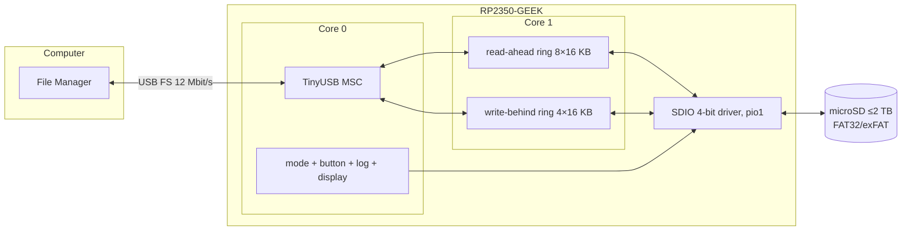
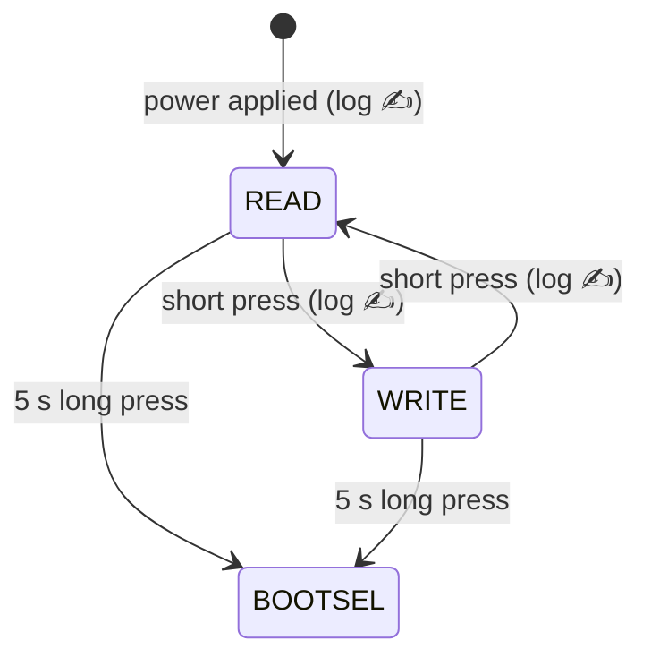
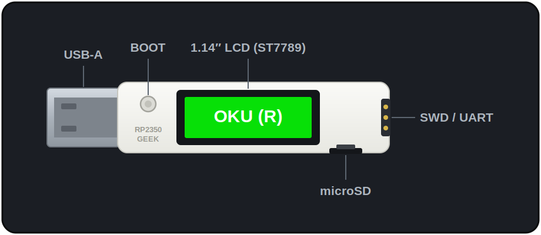
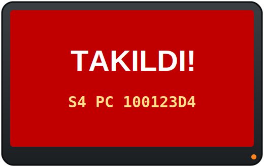

# RP2350 USB Write Blocker — Hardware Write-Locked USB Disk

[🇹🇷 Türkçe](README.md) | 🇬🇧 English

<p align="center">
  
  
</p>

<p align="center">
  <a href="https://github.com/haliskilic/rp2350-usb-write-blocker/releases"></a>
  
  
  
</p>

Firmware that turns the Waveshare **RP2350-GEEK** dev board into a
**hardware write-locked USB flash drive** backed by its microSD card.
Plugged into a computer it looks like an ordinary USB disk — but it is
**read-only by default**, and write permission is granted only via the
physical button on the board. Every power-up, every mode switch and the
duration of the previous session are recorded into the card's own `logs/`
folder.

On-screen labels are Turkish: **OKU (R)** = READ (read-only, green),
**YAZ (RW)** = WRITE (read-write, red).

**Use cases:** tamper-resistant data transport, safely pulling data from
field data-loggers, "can't-be-overwritten" recovery/image carriers, USB
stick hygiene (a compromised host can't drop anything onto the disk).

---

## Contents

- [Features](#features)
- [How it works](#how-it-works)
- [Hardware](#hardware)
- [Installation](#installation)
- [Usage](#usage)
- [Logging](#logging)
- [Diagnostics mode](#diagnostics-mode)
- [Performance](#performance)
- [File tree](#file-tree)
- [Troubleshooting](#troubleshooting)
- [License](#license)

---

## Features

| | |
|---|---|
| 🔒 **Mode lock** | Default **READ** (read-only, `WRITE PROTECTED` at the MSC layer); button toggles to **WRITE** |
| 🖥️ **Display** | Huge colour-coded mode indicator on the 1.14" ST7789 (green READ / red WRITE) |
| 📝 **Logging** | Every power-up, previous session duration, every button press → `logs/events.log` |
| ♻️ **Circular logs** | Auto-rotation at 500 MB; logs can **never exceed 1 GB** total |
| ⚡ **Dual-core I/O** | Core-1 read-ahead + write-behind engines; SDIO 4-bit → speed at the USB ceiling |
| 🩺 **Self-diagnostics** | Watchdog + crash PC/LR reported via the USB serial number |
| 🔁 **Easy updates** | Hold the button 5 s → device drops into BOOTSEL, drag-and-drop UF2 |
| 🧯 **FS coherence** | Host and device never write the FAT concurrently (ownership handoff + media re-insertion) |

## How it works



**Coherence model:** only one side ever writes the filesystem. In READ mode
the host is read-only and the device writes log lines. In WRITE mode
ownership passes to the host; the device unmounts FatFs and buffers its log
lines in RAM. On every toggle the media is "ejected and re-inserted" for
~2.5 s in the host's eyes, so the host continues with a fresh FAT table and
an up-to-date write-protect flag.



## Hardware

<p align="center"></p>
<p align="center"><sub><i>RP2350-GEEK — labeled schematic illustration</i></sub></p>

- **Board:** [Waveshare RP2350-GEEK](https://www.waveshare.com/wiki/RP2350-GEEK)
  (RP2350A, 2×Cortex-M33 @150 MHz, 520 KB SRAM, 4 MB flash, 1.14" LCD,
  microSD slot, male USB-A)
- **microSD:** any FAT32/exFAT card (tested with 64 GB)

| Function | Interface | GPIO |
|----------|-----------|------|
| LCD (ST7789, 240×135) | spi1 | CLK=10, MOSI=11, CS=9, DC=8, RST=12, **BL=25** |
| microSD | SDIO 4-bit (pio1) | CLK=18, CMD=19, D0-D3=20-23 |
| Button | BOOTSEL | — |

> ⚠️ The `BL=13` definition in the official 01-LCD demo is **wrong** for
> this board (a leftover from the older Pico-LCD-1.14); the schematic says
> BL=GPIO25. This repository uses the corrected value.

## Installation

### Option 1: Prebuilt UF2 (recommended)

1. Download `usbwriteblocker.uf2` from
   [Releases](https://github.com/haliskilic/rp2350-usb-write-blocker/releases).
2. Insert a FAT32/exFAT-formatted microSD into the board.
3. Plug the board in **BOOTSEL mode**: **hold the BOOT button while
   plugging into USB**, then release. A drive named `RP2350` appears.
4. Drag and drop the UF2 onto that drive. The board reboots; the screen
   shows blue "Baslatiliyor..." then green **OKU (R)**.
5. A read-only USB disk appears on the computer. Done!

> 💡 Future updates need no replugging: hold the button for **5 s** and the
> device drops itself into BOOTSEL.

### Option 2: Build from source

Requirements (Debian/Ubuntu):

```bash
sudo apt install gcc-arm-none-eabi libnewlib-arm-none-eabi \
                 libstdc++-arm-none-eabi-newlib cmake ninja-build git
```

Build:

```bash
git clone https://github.com/haliskilic/rp2350-usb-write-blocker.git
cd rp2350-usb-write-blocker
scripts/setup.sh    # clones pico-sdk 2.1.1 + tinyusb (once, ~1 min)
scripts/build.sh    # → build/usbwriteblocker.uf2
scripts/flash.sh    # auto-flashes if the board is in BOOTSEL
```

### Preparing the SD card (if needed)

If the card is not FAT32/exFAT — full-card FAT32 on Linux (64 KB clusters
recommended):

```bash
sudo sfdisk /dev/sdX <<'EOF'
label: dos
start=8192, type=c
EOF
sudo mkfs.fat -F 32 -s 128 -n SDCARD /dev/sdX1
```

Formatting can also be done **directly over USB while the card is in WRITE
mode**.

## Usage

| Button | Effect |
|--------|--------|
| **Short press** (<1 s) | READ ↔ WRITE toggle (~2.5 s; screen colour changes) |
| **Long press** (≥5 s) | Reboot into the USB bootloader (BOOTSEL) → UF2 update |
| Any press in diagnostics mode | Straight to BOOTSEL |

- **READ (green, "OKU (R)"):** the host can read; write attempts are
  rejected by the OS as "write-protected".
- **WRITE (red, "YAZ (RW)"):** the host reads and writes. When done, a
  short press returns to READ — pending writes are flushed to the card and
  the event is logged, no "safe eject" required.
- On every power-up the device starts in the safe default, READ.
- With rapid consecutive presses the host may coalesce intermediate
  transitions into one media change; the device logs every press and the
  host always settles on the correct final mode.

## Logging

Inside the card, the `logs/` folder:

```
logs/
├── events.log       ← human-readable event lines (sample below)
├── events.old.log   ← rotated previous generation (if any)
└── state.txt        ← boot counter + uptime (updated every 10 s;
                        starts with project-link + contact comment lines)
```

Sample `events.log` (labels are Turkish: ENERJILENDIRME = power-up,
BUTON = button):

```
[t+1s   | boot#6] === ENERJILENDIRME === boot#6 | onceki oturum ~696 sn calisti (enerji kesildi) | mod: OKU(R)
[t+101s | boot#6] BUTON: mod OKU(R) -> YAZ(RW)
[t+106s | boot#6] BUTON: mod YAZ(RW) -> OKU(R)
```

- There is no RTC; timestamps are `t+<seconds>` since boot plus a `boot#N`
  counter. After sudden power loss, the previous session's duration is
  logged on the next boot with ~10 s resolution.
- **Circular cap:** when `events.log` exceeds 500 MB it rotates to
  `events.old.log` (the previous one is deleted) → logs can **never exceed
  1 GB**. Verified end-to-end with a real 505 MB file.

## Diagnostics mode



The firmware is guarded by an 8 s hardware watchdog; every risky step (LCD
init, SD init, mount, log I/O, MSC read/write) is tagged with a stage code.
If the device ever hangs, the watchdog resets it and on the next boot:

- the screen shows `TAKILDI! S<n>` ("STUCK!") plus the crash PC if known,
- the USB serial number gains a `S<stage>-P<PC>-L<LR>` suffix → read it
  with `lsusb -v`, resolve the line with
  `arm-none-eabi-addr2line -e build/*.elf 0x<PC>`,
- storage steps are skipped so the device stays alive; a single press drops
  it into BOOTSEL.

Additionally the carlk3 crash record (a fault frame in RAM that survives
reset) is recovered at boot — diagnosis needs no external tools at all.

## Performance

| Metric | Value | Note |
|---|---|---|
| Sequential read | **~1.0 MB/s** | practical ceiling of full-speed USB |
| Steady-state write | **~930 kB/s** | write-behind + SDIO; verified with a 505 MB uninterrupted write |
| Random 4 KB | ~4-18 ms | SDIO 4-bit |
| Plug-in → disk on desktop | **~3 s** | |
| Data integrity | SHA-256 bit-exact | 8 MB random pattern, 2 independent runs |

> The RP2350's USB controller is **full-speed** (12 Mbit/s) in silicon —
> the values above are the platform's physical limit. See
> [`docs/DESIGN.en.md`](docs/DESIGN.en.md) for architecture details and
> field case studies.

Optional udev rule that shortens plug-in time on Linux desktops:

```bash
sudo tee /etc/udev/rules.d/59-rp2350-geek.rules <<'EOF'
ACTION=="add", SUBSYSTEM=="block", ATTRS{idVendor}=="cafe", ATTRS{idProduct}=="4001", ATTR{queue/read_ahead_kb}="32"
EOF
sudo udevadm control --reload-rules
```

## File tree

```
rp2350-usb-write-blocker/
├── CMakeLists.txt          # root build definition (pico2 / rp2350-arm-s)
├── pico_sdk_import.cmake   # Pico SDK locator
├── LICENSE                 # permission-required license + third-party notices
├── scripts/
│   ├── setup.sh            # clones pico-sdk 2.1.1 + tinyusb (one-time)
│   ├── build.sh            # cmake+ninja → build/usbwriteblocker.uf2
│   └── flash.sh            # flashes via picotool or by copying to the BOOTSEL drive
├── src/                    # ── application (all original to this project) ──
│   ├── main.c              # entry; USB-first boot sequencing + cooperative main loop
│   ├── config.h            # pins, timings, log paths, the 1 GB log cap
│   ├── msc_disk.c          # USB MSC callbacks; mode lock, SYNC/eject handling
│   ├── usb_descriptors.c   # single-MSC USB identity; embeds diagnostics into the serial
│   ├── mode.c/.h           # READ↔WRITE state machine; media re-insertion protocol
│   ├── logger.c/.h         # event/session logging onto FAT + circular rotation
│   ├── button.c/.h         # BOOTSEL sampling (flash-CS trick) + debounce + long press
│   ├── display.c/.h        # huge 2× scaled mode text on the ST7789
│   ├── readahead.c/.h      # core-1 engine: read-ahead + write-behind rings,
│   │                       #   sequential heuristic, capacity clamp, epoch invalidation
│   ├── diag.c/.h           # watchdog + scratch-register stage tracking
│   ├── hw_config.c         # SD card definition (SDIO 4-bit, pio1, 18.75 MHz)
│   └── tusb_config.h       # TinyUSB configuration (MSC-only, 16 KB EP buffer)
├── lib/                    # ── vendored third-party (local patches marked) ──
│   ├── no-OS-FatFS-SD-SDIO-SPI-RPi-Pico/   # carlk3 SD driver + FatFs
│   └── waveshare_lcd/                       # Waveshare LCD/GUI/font library
└── docs/
    ├── DESIGN.md / DESIGN.en.md   # architecture decisions + field case studies
    └── images/                     # screen mock-ups (SVG)
```

**Vendor-library bugs found and patched during this project** (each marked
in-file with a `DUZELTME (yerel yama)` — "FIX (local patch)" — comment):

1. `LCD_1in14_V2.c` — screen clear allocated a 64.8 KB array on an 8 KB stack (memory corruption)
2. `GUI_Paint.c` — 65K-colour mode overran the frame buffer by 480 bytes every frame
3. `crash.c` (carlk3) — unconditional `BKPT` in the fault handler → permanent LOCKUP without a debugger
4. `sd_card_spi.c` (carlk3) — orphaned DMA pair on CRC error → potential permanent wedge

## Troubleshooting

| Symptom | Cause / Fix |
|---|---|
| No disk at all, screen shows `TAKILDI! S<n>` | Diagnostics mode: read the stage/PC from the serial number via `lsusb -v`; one press enters BOOTSEL |
| SD missing after switching from an older SPI firmware | The SD card latches SPI mode — **physically unplug and replug** (a warm reboot is not enough) |
| Mode changed but the host acts on the old mode | Leave ≥5 s between presses; the host always converges on the final mode |
| Disk appears slowly on Linux | Add the udev rule above (drops to ~3 s) |
| "Volume was not properly unmounted" warnings | Harmless (mode toggles "yank" the media); `fsck.vfat -a` in WRITE mode clears it |

## License

The project code (`src/`, `scripts/`, `docs/`) is **source-available,
permission-required**: any use (copying, modification, distribution,
commercial or not) requires **prior written permission** from the copyright
holder. For licensing: **Halis Kılıç — mail@haliskilic.com.tr**

Third-party components under `lib/` are not subject to this license; they
keep their own (carlk3: Apache-2.0, FatFs: BSD-like, Waveshare: MIT, STM
fonts: BSD-3-Clause) — details in [`LICENSE`](LICENSE).
