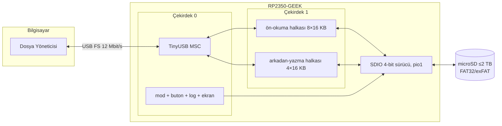
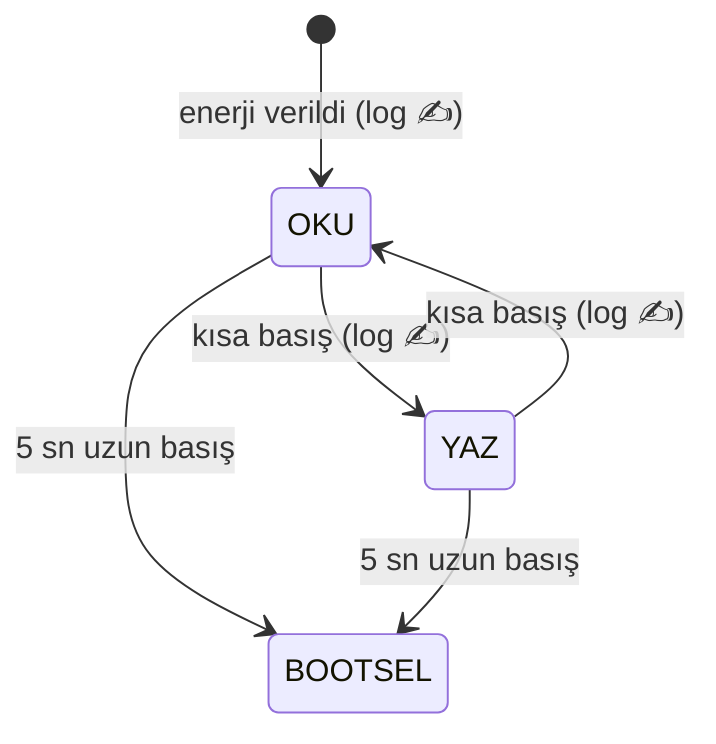

# RP2350 USB Write Blocker — Donanım Yazma-Kilitli USB Disk

🇹🇷 Türkçe | [🇬🇧 English](README.en.md)

<p align="center">
  
  
</p>

<p align="center">
  <a href="https://github.com/haliskilic/rp2350-usb-write-blocker/releases"></a>
  
  
  
</p>

Waveshare **RP2350-GEEK** geliştirme kartını, takılı microSD kartı sunan
**donanım yazma-kilitli bir USB bellek** haline getiren gömülü yazılım.
Bilgisayara takıldığında sıradan bir USB disk gibi görünür — ama varsayılan
olarak **salt-okunurdur** ve yazma izni yalnızca karttaki fiziksel butonla
verilir. Her enerji verilişi, her mod geçişi ve önceki oturumun süresi kartın
içindeki `logs/` klasörüne kaydedilir.

**Kullanım senaryoları:** kurcalanmaya karşı korumalı veri taşıma, sahada
log toplayan cihazlardan güvenli veri alma, "yanlışlıkla üzerine yazılamayan"
kurtarma/imaj taşıyıcısı, USB bellek hijyeni (host'a takıldığında host'un
diske bir şey bulaştıramaması).

---

## İçindekiler

- [Özellikler](#özellikler)
- [Nasıl çalışır](#nasıl-çalışır)
- [Donanım](#donanım)
- [Kurulum](#kurulum)
  - [Yol 1: Hazır UF2 (önerilen)](#yol-1-hazır-uf2-önerilen)
  - [Yol 2: Kaynaktan derleme](#yol-2-kaynaktan-derleme)
- [Kullanım](#kullanım)
- [Loglama](#loglama)
- [Teşhis modu](#teşhis-modu)
- [Performans](#performans)
- [Dosya ağacı](#dosya-ağacı)
- [Sorun giderme](#sorun-giderme)
- [Lisans](#lisans)

---

## Özellikler

| | |
|---|---|
| 🔒 **Mod kilidi** | Varsayılan **OKU** (salt-okunur, MSC katmanında `WRITE PROTECTED`); butonla **YAZ**'a geçiş |
| 🖥️ **Ekran** | 1.14" ST7789'da kocaman, renk kodlu mod göstergesi (yeşil OKU / kırmızı YAZ) |
| 📝 **Loglama** | Her enerjilendirme, önceki oturum süresi, her buton basımı → `logs/events.log` |
| ♻️ **Dairesel log** | 500 MB'da otomatik devrilme; loglar toplam **1 GB'ı asla aşamaz** |
| ⚡ **Çift çekirdek G/Ç** | Core-1 ön-okuma + arkadan-yazma motorları; SDIO 4-bit → USB tavanında hız |
| 🩺 **Öz-teşhis** | Watchdog + çökme PC/LR'ının USB seri numarasıyla raporlanması |
| 🔁 **Kolay güncelleme** | Butona 5 sn basılı tut → cihaz kendini BOOTSEL'e atar, UF2 sürükle-bırak |
| 🧯 **FS tutarlılığı** | Host ve cihaz FAT'e asla aynı anda yazmaz (sahiplik devri + medya yeniden-takma) |

## Nasıl çalışır



**Tutarlılık modeli:** dosya sistemine her an yalnızca tek taraf yazar.
OKU modunda host salt-okunurdur, log satırlarını cihaz yazar. YAZ modunda
sahiplik host'a geçer; cihaz FatFs'i bırakır, logları RAM'de biriktirir.
Her mod geçişinde medya host gözünde ~2,5 sn "çıkarılıp takılır" — host
taze FAT tablosu ve güncel yazma-koruma durumuyla devam eder.



## Donanım

<p align="center"></p>
<p align="center"><sub><i>RP2350-GEEK — etiketli şematik gösterim</i></sub></p>

- **Kart:** [Waveshare RP2350-GEEK](https://www.waveshare.com/wiki/RP2350-GEEK)
  (RP2350A, 2×Cortex-M33 @150 MHz, 520 KB SRAM, 4 MB flash, 1.14" LCD,
  microSD yuvası, USB-A erkek)
- **microSD:** FAT32 veya exFAT formatlı herhangi bir kart (64 GB ile test edildi)

| İşlev | Arayüz | GPIO |
|------|--------|------|
| LCD (ST7789, 240×135) | spi1 | CLK=10, MOSI=11, CS=9, DC=8, RST=12, **BL=25** |
| microSD | SDIO 4-bit (pio1) | CLK=18, CMD=19, D0-D3=20-23 |
| Buton | BOOTSEL | — |

> ⚠️ Resmî 01-LCD demosundaki `BL=13` tanımı bu kart için **yanlıştır**
> (eski Pico-LCD-1.14'ten kalma); şematik BL=GPIO25 der. Bu depo düzeltilmiş
> değeri kullanır.

## Kurulum

### Yol 1: Hazır UF2 (önerilen)

1. [Releases](https://github.com/haliskilic/rp2350-usb-write-blocker/releases)
   sayfasından `usbwriteblocker.uf2` dosyasını indirin.
2. Karta FAT32/exFAT formatlı bir microSD takın.
3. Kartı **BOOTSEL modunda** bilgisayara takın: **BOOT butonuna basılı
   tutarken USB'ye takın**, sonra bırakın. `RP2350` adlı bir sürücü belirir.
4. UF2 dosyasını bu sürücüye sürükleyip bırakın. Kart kendini yeniden
   başlatır; ekranda mavi "Baslatiliyor..." ardından yeşil **OKU (R)** görünür.
5. Bilgisayarda salt-okunur bir USB disk belirir. Bitti!

> 💡 Bir sonraki güncellemede tak-çıkar gerekmez: butona **5 sn basılı
> tutun**, cihaz kendini BOOTSEL'e atar.

### Yol 2: Kaynaktan derleme

Gereksinimler (Debian/Ubuntu):

```bash
sudo apt install gcc-arm-none-eabi libnewlib-arm-none-eabi \
                 libstdc++-arm-none-eabi-newlib cmake ninja-build git
```

Derleme:

```bash
git clone https://github.com/haliskilic/rp2350-usb-write-blocker.git
cd rp2350-usb-write-blocker
scripts/setup.sh    # pico-sdk 2.1.1 + tinyusb klonlar (bir kez, ~1 dk)
scripts/build.sh    # → build/usbwriteblocker.uf2
scripts/flash.sh    # kart BOOTSEL'deyse otomatik yükler
```

### SD kartı hazırlama (gerekirse)

Kart FAT32/exFAT değilse — Linux'ta tam-kart FAT32 (64 KB cluster önerilir):

```bash
sudo sfdisk /dev/sdX <<'EOF'
label: dos
start=8192, type=c
EOF
sudo mkfs.fat -F 32 -s 128 -n SDKART /dev/sdX1
```

Formatlama, kart **YAZ modundayken doğrudan USB üzerinden de** yapılabilir.

## Kullanım

| Buton | Etki |
|-------|------|
| **Kısa basış** (<1 sn) | OKU ↔ YAZ mod geçişi (~2,5 sn sürer; ekran rengi değişir) |
| **Uzun basış** (≥5 sn) | USB bootloader'a (BOOTSEL) geçiş → UF2 ile güncelleme |
| Teşhis modunda herhangi bir basış | Doğrudan BOOTSEL |

- **OKU (yeşil):** Host diski okur; yazma denemeleri işletim sistemi
  tarafından "yazma korumalı" hatasıyla reddedilir.
- **YAZ (kırmızı):** Host okur ve yazar. İşiniz bitince kısa basışla OKU'ya
  dönün — güvenli çıkarma yapmanıza gerek kalmadan bekleyen yazmalar diske
  iner ve log düşülür.
- Her enerji verilişinde cihaz **güvenli varsayılan olan OKU** ile açılır.
- Hızlı ardışık basışlarda host ara geçişleri tek medya değişimi olarak
  birleştirebilir; cihaz her basışı ayrı loglar ve host her zaman doğru
  nihai moda oturur.

## Loglama

Kartın içinde `logs/` klasörü:

```
logs/
├── events.log       ← insan-okur olay satırları (aşağıda örnek)
├── events.old.log   ← devrilmiş önceki nesil (varsa)
└── state.txt        ← boot sayacı + uptime (10 sn'de bir güncellenir;
                        başında proje bağlantısı + iletişim yorum satırları)
```

Örnek `events.log`:

```
[t+1s   | boot#6] === ENERJILENDIRME === boot#6 | onceki oturum ~696 sn calisti (enerji kesildi) | mod: OKU(R)
[t+101s | boot#6] BUTON: mod OKU(R) -> YAZ(RW)
[t+106s | boot#6] BUTON: mod YAZ(RW) -> OKU(R)
```

- Kartta RTC yoktur; damgalar `t+<saniye>` (açılıştan itibaren) + `boot#N`
  biçimindedir. Ani elektrik kesintisinde önceki oturumun süresi ~10 sn
  çözünürlükle bir sonraki açılışta loglanır.
- **Dairesel tavan:** `events.log` 500 MB'ı aşınca `events.old.log`'a
  devrilir (öncekisi silinir) → loglar toplam **1 GB'ı aşamaz**. 505 MB'lık
  gerçek dosyayla uçtan uca doğrulanmıştır.

## Teşhis modu


Firmware 8 sn'lik donanım watchdog'u ile korunur; her riskli adım (LCD init,
SD init, mount, log G/Ç, MSC okuma/yazma) bir aşama koduyla işaretlenir.
Donma olursa watchdog resetler ve bir sonraki açılışta:

- Ekranda `TAKILDI! S<n>` + varsa çökme PC'si gösterilir,
- USB seri numarasına `S<aşama>-P<PC>-L<LR>` eklenir → `lsusb -v` ile okunur,
  `arm-none-eabi-addr2line -e build/*.elf 0x<PC>` ile çöken satır bulunur,
- depolama adımları atlanır, cihaz ayakta kalır; tek basış BOOTSEL'e alır.

Ek olarak carlk3 çökme kaydı (RAM'de reset'i atlatan fault çerçevesi) boot'ta
okunur — teşhis, kart üzerinde başka hiçbir araç olmadan yapılabilir.

## Performans

| Metrik | Değer | Not |
|---|---|---|
| Sıralı okuma | **~1,0 MB/s** | Full-speed USB pratik tavanı |
| Kararlı yazma | **~930 kB/s** | Write-behind + SDIO; 505 MB kesintisiz doğrulandı |
| Rastgele 4 KB | ~4-18 ms | SDIO 4-bit |
| Takılış → masaüstünde disk | **~3 sn** | |
| Veri bütünlüğü | SHA-256 birebir | 8 MB rastgele desen, 2× bağımsız test |

> RP2350'nin USB denetleyicisi donanımsal olarak **full-speed**tir
> (12 Mbit/s) — üstteki değerler platformun fiziksel üst sınırıdır.
> Mimari ayrıntılar ve saha vakaları için [`docs/DESIGN.md`](docs/DESIGN.md).

Linux masaüstlerinde takılış süresini kısaltan isteğe bağlı udev kuralı:

```bash
sudo tee /etc/udev/rules.d/59-rp2350-geek.rules <<'EOF'
ACTION=="add", SUBSYSTEM=="block", ATTRS{idVendor}=="cafe", ATTRS{idProduct}=="4001", ATTR{queue/read_ahead_kb}="32"
EOF
sudo udevadm control --reload-rules
```

## Dosya ağacı

```
rp2350-usb-write-blocker/
├── CMakeLists.txt          # kök derleme tanımı (pico2 / rp2350-arm-s)
├── pico_sdk_import.cmake   # Pico SDK bulucu
├── LICENSE                 # izne tabi lisans + üçüncü parti bildirimleri
├── scripts/
│   ├── setup.sh            # pico-sdk 2.1.1 + tinyusb klonlar (tek sefer)
│   ├── build.sh            # cmake+ninja → build/usbwriteblocker.uf2
│   └── flash.sh            # picotool ya da BOOTSEL sürücüsüne kopyalayarak yükler
├── src/                    # ── uygulama (tamamı bu projeye özgü) ──
│   ├── main.c              # giriş; USB-önce açılış sıralaması + kooperatif ana döngü
│   ├── config.h            # pinler, zamanlamalar, log yolları, 1 GB log tavanı
│   ├── msc_disk.c          # USB MSC geri çağırmaları; mod kilidi, SYNC/eject işleme
│   ├── usb_descriptors.c   # tek-MSC USB kimliği; teşhis bilgisini seri no'ya işler
│   ├── mode.c/.h           # OKU↔YAZ durum makinesi; medya yeniden-takma protokolü
│   ├── logger.c/.h         # FAT üzerine olay/oturum loglama + dairesel devrilme
│   ├── button.c/.h         # BOOTSEL okuma (flash-CS tekniği) + debounce + uzun basış
│   ├── display.c/.h        # ST7789'da 2× ölçekli kocaman mod yazıları
│   ├── readahead.c/.h      # çekirdek-1 motoru: ön-okuma + arkadan-yazma halkaları,
│   │                       #   ardışıklık sezgisi, kapasite sınırı, epoch geçersizleme
│   ├── diag.c/.h           # watchdog + scratch-register aşama izleme
│   ├── hw_config.c         # SD kart tanımı (SDIO 4-bit, pio1, 18,75 MHz)
│   └── tusb_config.h       # TinyUSB yapılandırması (MSC-only, 16 KB EP tamponu)
├── lib/                    # ── gömülü üçüncü parti (yerel yamalar işaretli) ──
│   ├── no-OS-FatFS-SD-SDIO-SPI-RPi-Pico/   # carlk3 SD sürücüsü + FatFs
│   └── waveshare_lcd/                       # Waveshare LCD/GUI/font kütüphanesi
└── docs/
    ├── DESIGN.md           # mimari kararlar + saha vakaları (kök neden analizleriyle)
    └── images/             # ekran görselleri (SVG)
```

**Vendor kütüphanelerinde bu proje sırasında bulunup yamalanan hatalar**
(hepsi dosya içinde `DUZELTME (yerel yama)` yorumuyla işaretli):

1. `LCD_1in14_V2.c` — ekran temizleme 64,8 KB'lık diziyi 8 KB'lık yığında açıyordu (bellek bozulması)
2. `GUI_Paint.c` — 65K-renk modunda her karede tamponun 480 bayt ötesine yazım
3. `crash.c` (carlk3) — fault işleyicisinde koşulsuz `BKPT` → debugger'sız kalıcı LOCKUP
4. `sd_card_spi.c` (carlk3) — CRC hatasında sahipsiz bırakılan DMA çifti → potansiyel sonsuz kilitlenme

## Sorun giderme

| Belirti | Neden / Çözüm |
|---|---|
| Disk hiç görünmüyor, ekran `TAKILDI! S<n>` | Teşhis modu: `lsusb -v` ile seri numarasındaki aşama/PC'yi okuyun; tek basış BOOTSEL'e alır |
| SPI'lı eski firmware'den geçişte SD gelmiyor | SD kart SPI modunda kilitli kalır — cihazı **fiziksel çıkarıp takın** (warm reboot yetmez) |
| Mod değişti ama host eski modda davranıyor | Basışlar arası ≥5 sn bekleyin; host nihai moda her zaman yakınsar |
| Linux'ta disk geç görünüyor | Yukarıdaki udev kuralını ekleyin (~3 sn'ye iner) |
| "Volume was not properly unmounted" uyarısı | Zararsızdır (mod geçişi medyayı "çekip takar"); YAZ modunda `fsck.vfat -a` temizler |

## Lisans

Proje kodu (`src/`, `scripts/`, `docs/`) **kaynağı görünür, izne tabi**
lisanslıdır: her türlü kullanım (kopyalama, değiştirme, dağıtma, ticari/
ticari olmayan) için telif sahibinden **önceden yazılı izin** gerekir.
Lisans anlaşması için: **Halis Kılıç — mail@haliskilic.com.tr**

`lib/` altındaki üçüncü parti bileşenler bu lisansa tabi değildir; kendi
lisanslarını korur (carlk3: Apache-2.0, FatFs: BSD-benzeri, Waveshare: MIT,
STM fontları: BSD-3-Clause) — ayrıntılar [`LICENSE`](LICENSE) dosyasında.
